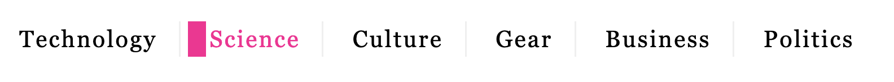

# Exercise SASS

Jullie hebben al de volledige HTML van onderstaande website gekregen


Bedoeling is dat je de opmaak toevoegt door gebruik te maken van sass. Focus je vooral op variabelen, nesting en het gebruik van `@import` en `@forward`.

We maken gebruik van de volgende font-imports:

```scss
@font-face {
    font-family: "BrutalBold";
    src: url("../fonts/brutal-bold.woff2") format("woff2")
}

@font-face {
    font-family: "Brutal";
    src: url("../fonts/brutal.woff2") format("woff2")
}

@font-face {
    font-family: "New Grotesk Square Bold";
    src: url("../fonts/new-grotesk-square.woff2") format("woff2")
}


//standaard font
$default-font: Brutal, Arial, Helvetica, sans-serif;

// de titels van de artikelen
$bolder-font: "BrutalBold", Arial, Helvetica, sans-serif;

// voor de header met navigatielinks
$header-font: Georgia, Cambria, 'Times New Roman', Times, sans-serif;

// binnen de aside en de beschrijving van de artikels
$secondary-font: "New Grotesk Square Bold", Arial, Helvetica, sans-serif;
```

Er zijn ook nog enkele dynamische elementen:

1. Hoveren over een link in het navigatiemenu verandert de tekstkleur naar `deepppink` en voegt een blokje aan de linkerkant toe.



2. Hoveren over een link in de sectie introductie verwijdert de onderlijn.

3. Wanneer het tekstvak om je a-mail adres in te vullen de focus krijgt, verandert de achtergrondkleur van `greenyellow` naar `orange`.

4. Wanneer je over een link in de footer hovert, wordt deze onderlijnt